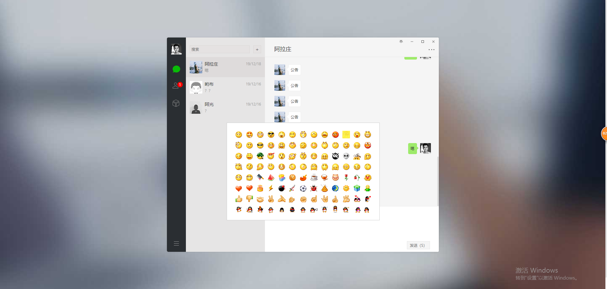
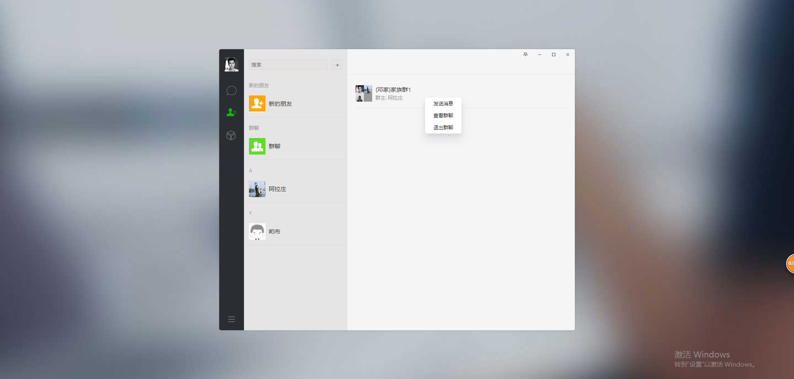

# 仿微信聊天网页版
一个 PHP+CI框架+GatewayWorker+AmazeUI仿微信聊天网页版

## 更新

- 2019-01-07 新增发送图片与文件、下载功能

- 2019-01-05 新增群聊

## 使用

- 下载源码

- 修改config.php中的$config['base_url']，配置为你的域名

- 打开gatewayWorker文件夹，点击运行start_for_win.bat

- 联系我（QQ：2575404985或微信：yangyang92428）捐赠20元获取数据库和GatewayWorker文件

- 访问：http://你的域名/home/chat/index

## 界面

具体设计可查看：[PHP 之CI框架+GatewayWorker+AmazeUI仿微信聊天网页版](https://www.cnblogs.com/yang-2018/p/12083294.html)
